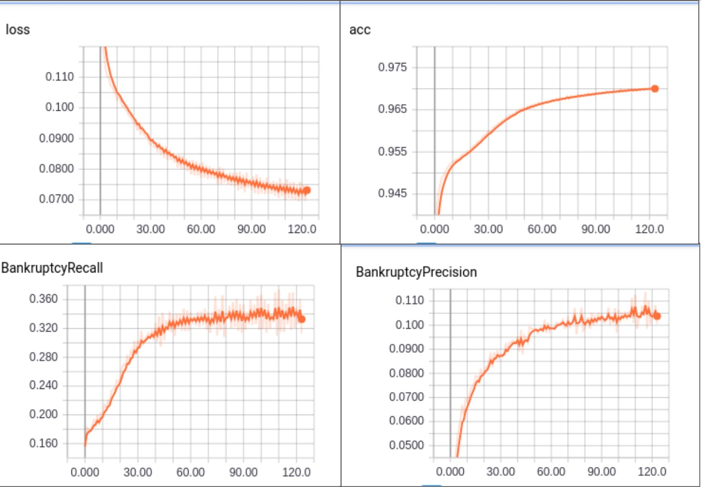
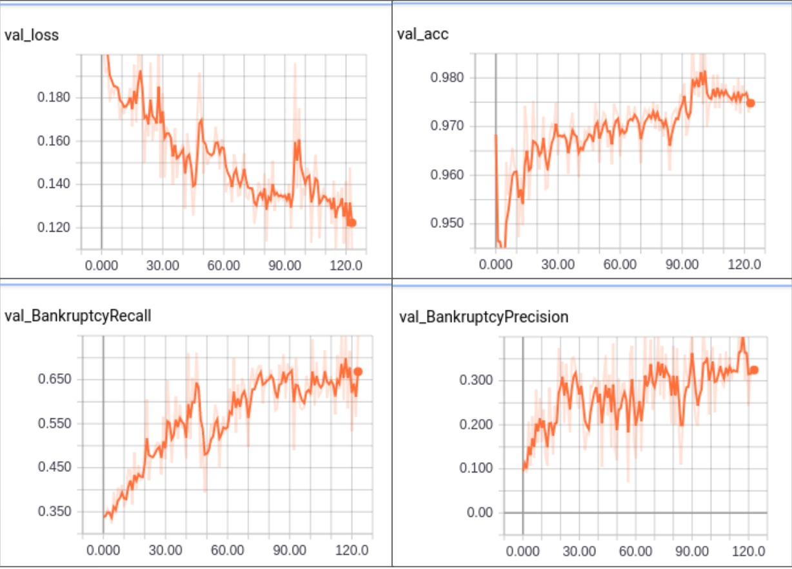
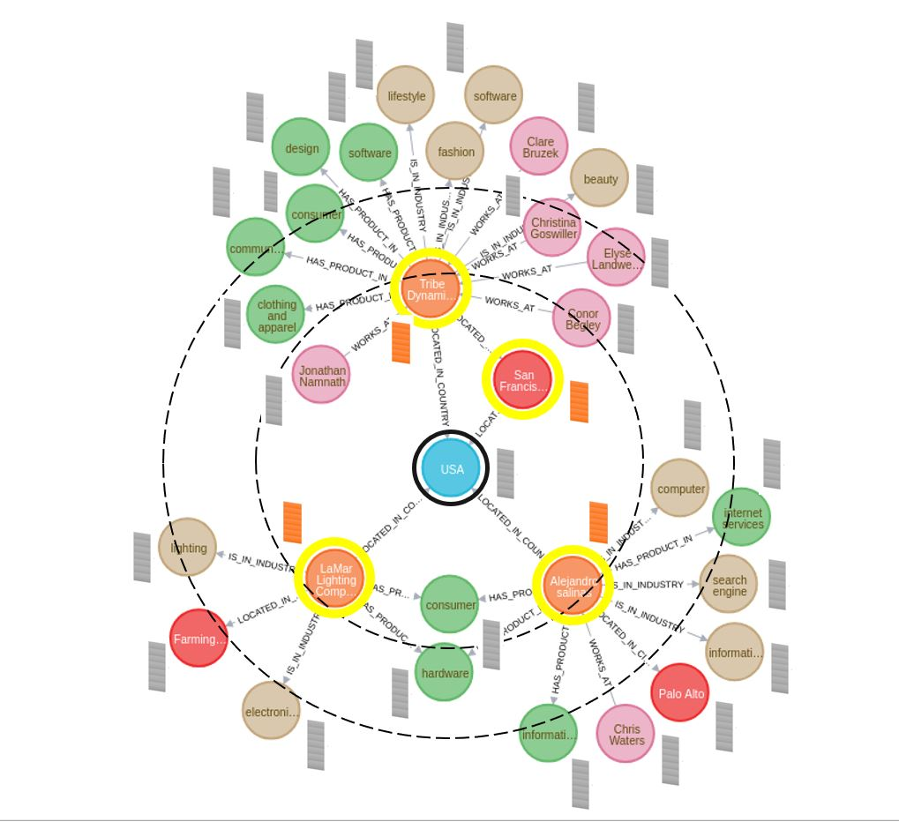
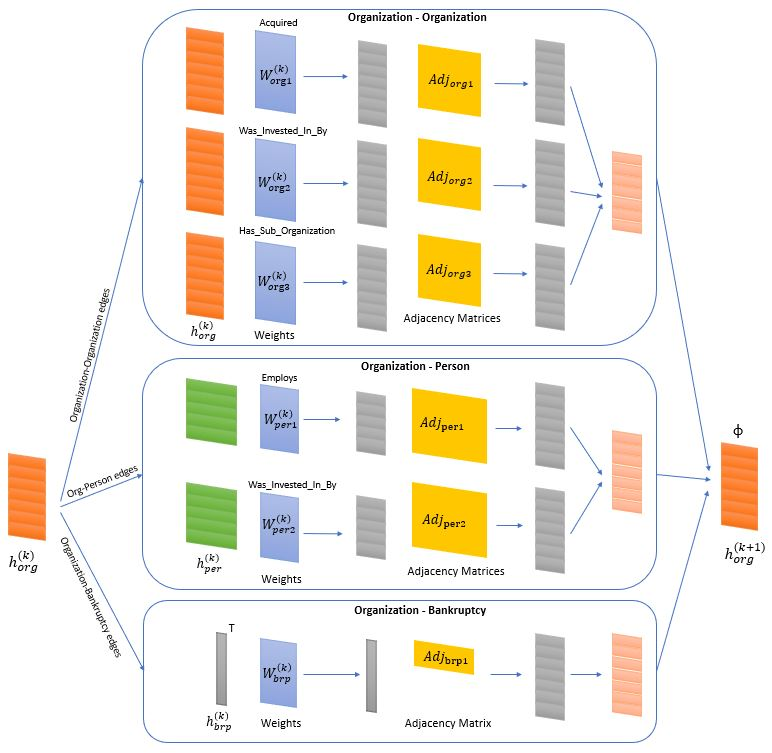
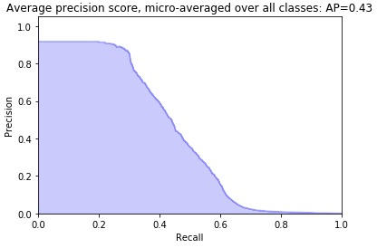
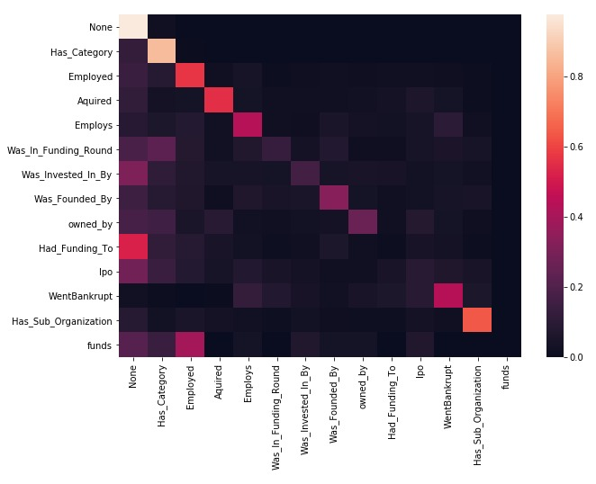

# Deep Link Prediction for Graphical Database

    

In recent years, deep learning has achieved great success in the fields of vision, speech, and natural language understanding. The ability of deep learning to extract underlying patterns from complex, large-scale and high-dimensional data is well recognized. Many real-world applications are built on a graphical database, and thus utilize graphs for storing data. The graph here means a directed, attributed multi-graph with data stored as nodes and relationships (links) between nodes stored as edges. Graphical databases are ubiquitous and often consist of hundreds of millions of nodes and relationships. There is rich information embedded in the complex topology of these graphs that can be leveraged when doing inference on the data stored in them. Our goal is to utilize deep learning models to extract this information and predict bankruptcies. 

In order to address the aforementioned problem, we followed two distinct approaches. In the first approach, we propose a Graph-Based Classification Model using a Convolutional Neural Network (CNN) that uses nodal features as well as the structure of a node's local sub-graph to predict links between graph nodes by using an adjacency matrix formulation. In the second approach, we propose a Graph Convolutional Neural Network (GCNN) which has a structure similar to an autoencoder. This formulation enables us to use our prior information about the structure of the graph more efficiently by putting a relational inductive bias [1] into our model.

## Related Work
Neural networks that operate on graphs, and structure their computations accordingly, have been
developed and explored extensively for more than a decade under the umbrella of “graph neural
networks” [2], but have grown rapidly in scope and popularity in recent years.

Models in the graph neural network family, e.g. [3], have been explored in a diverse range of problem
domains, across supervised, semi-supervised, unsupervised, and reinforcement learning settings.
These models have been effective at tasks thought to have rich relational structure, such as visual
scene understanding tasks [4] and few-shot learning [5]. They have also been extensively used to
reason about knowledge graphs [6,7]. For more applications of graph neural network models, see [1]
and references therein.

Recently, [8] introduced the message-passing neural network (MPNN), which unified various previous
graph neural network and graph convolutional network approaches by sequentially updating edge
attributes, node attributes and global attributes of the graph and transmitting the information after
each update. In a similar vein, [9] introduced the non-local neural network (NLNN), which unified
various “self-attention”-style methods by analogy to methods from computer vision and graphical
models for capturing long-range dependencies in signals.

Graph neural network models usually consist of Graph Network (GN) blocks and can be divided into
three main categories depending on the task that needs to be served. Node-focused and graph-focused
GNs use the nodes attributes and the global attributes as outputs respectively. On the other hand, in
the spirit of [10,11], our main scope in this project is the design of an edge-focused neural network in
order to predict the existence of an edge between two nodes as well as its corresponding label.

## Dataset 
Using CrunchBase’s enterprise API we scraped approximately 5 million nodes and 8 million edges that model the U.S. financial system with an emphasis on early stage companies. Node types included Organization, Person, IPO, Funding Round, Job, Website, News, Address, Picture, Acquisition, Category, Fund, and Investment. Edge labels include such relationships as Employs, Was Founded By, Acquired, Invested In, Employed, Funded, Board of Director, and several more for a total of 29 unique relationship labels. See the figure below.

    
    
Fig 1: Example sub-graph containing company, people, funding rounds, and product areas. Notice the highly interconnected nature of the nodes and variety of node types. 

In this figure the red nodes are companies and the small multi-colored nodes connected to them represent their Jobs, Persons, Funding Rounds, etc. To store this dataset we instantiated a NEO4J database and to query it we used py2neo; a python wrapper that can call NEO4J’s JAVA based cypher query engine. 

We collected our list of bankrupt companies using Bloomberg’s terminal API. To link the bankruptcies we found with the companies in the database we used simple string augmentation techniques like removing all co, org, corp, ltd, ect; all trailing ‘s’ characters; all spaces; and lowering all words. We choose to not use any string similarity metrics like Jaro or Levenshtein because we determined that even with a match threshold of 0.98 there was too much risk of false positives and injecting noise into our model. Using our techniques we found ~3.5k of the ~650k companies in our database had a match in the list of bankrupt companies scraped from Bloomberg. 

To integrate these matches into the graph in a way that conformed with our edge prediction problem formulation and topology sensitive models, we decided to create a single bankruptcy node and add a ‘Went_Bankrupt’ edge between it and every matched company. This linked every bankrupt company via the bankruptcy node and created rich adjacency matrices with multiple examples of bankrupt companies in each when predicting if an edge existed between the bankruptcy node and some new company in question. 

For licensing reasons we had to augment the aforementioned graph to obscure any identifiable information since we borrowed the data from one of our group member’s work group. To do this we embedded all nodal features using word2vec, TFiDF, and SVD. We also replaced all company names with a unique id. For memory and sparsity considerations we also converted several node types into edge features or, like in the case of Picture and Website, we dropped several node types altogether. For example, previously a graph walk could have included the series Picture<-Organization->Job->Person. After these conversions that walk would be Organization->Person with the features of that job as edge features. These conversions decreased the total number of node types to 8, number of nodes to 1.56M, number of edges to 3.14M, and edge types to 14.   

## Approaches 

### I. Image Segmentation Model

    
    
Fig 2. Auto-encoder architecture for the Image Segmentation Model(SegNet)

    
    
Fig 3. Training Loss, Accuracy, Bankruptcy Recall, and Bankruptcy Precision for SegNet Model

    
    
Fig 4. Validation Loss, Accuracy, Bankruptcy Recall, and Bankruptcy Precision for SegNet Model

### II. Graph Convolutional Neural Network Model
Our approach to building a model using Graph Convolutional Neural Network (GCNN) to solve the multi-relational link prediction task in a multimodal finance graph had to take care of an important observation relating to the nature of the dataset. There is a huge variation in the number node pairs that the data set contains corresponding to each edge type. Therefore, it becomes important that we develop an end-to-end approach such that the model shares the parameters from different edge types. 

In our approach, we build a non-linear, multi-layer neural network model designed to operate on a graph. The model has two main components:

- **Encoder:** The objective is to produce an embedding for each node in the graph
- **Decoder:** A model that uses these embeddings to perform tensor factorization and predicts the edges

We built an end-to-end model where the node embeddings are optimized jointly along with tensor factorization
We describe both the encoder and decoder in detail

#### GCNN Encoder  
The input to the encoder is the nodal feature vectors $$h_i$$, and the graph $$G = (V, R)$$ with nodes $$v_i \in V$$ and labeled edges $$(v_i, r, v_j)$$ where $$r \in R$$ is an edge type.  The output is a d-dimensional embedding $$h_{i}^{k+1}$$ for each node. 

    
    
Fig 5. A two-layer multimodal network for GCNN Model with convolutions across K-hop distances

For a given node, the model takes into account the feature vector of its first-order neighbors. Since each neighbor can be of a different node type and can have different edge label, we have a different neural network architecture for each node. Each node type can have different lengths of embeddings; therefore, it is important that each edge type has a different set of weights. Note, an edge type is different if the node types are reversed. The convolution operators we define in the encoder uses these weights depending on the neighbors and edge types. On the successive application of these convolution operators, we essentially convolve across a K-hop distance in the graph for each neighbor. In other words, each node’s embeddings would have been formed using the information passed from all it’s Kth-order neighbors while taking into account the different edge types *(Schlichtkrull et al., 2017)*. This is depicted in fig-5, which shows convolutions around a node. A single convolution on the neural network takes the following form 

##### $$h_{i}^{k+1} = \phi(\sum_r \sum_{j \epsilon N_r^i} c_r^{ij} W_r^k h_j^k + c_r^i h_i^k)$$  

Where $$h_i^k$$ the embedding of node $$v_i$$ in the kth layer with a dimensionality $$d^k$$, r is an edge type and $$W_k^r$$ is a weight/parameter matrix corresponding to it, $$\phi$$ represents a non-linear activation function, $$c_r^{ij}$$ are normalization constants. A more detailed view of one convolution for the encoder is depicted in fig-6. We build a two-layer model by stacking two layers of these. The input to the first layer is the node feature vectors or one-hot vectors if the features are not present.

    
    
Fig 6. Encoder Architecture for the GCNN Model

#### GCNN Decoder  
The input to the decoder is a pair of node embeddings that we want to decode. We treat each edge label differently i.e. we have a function $$g$$ that scores how likely it is that two nodes $$v_i$$ and $$v_j$$ have an edge type $$r$$ between them. 

##### $$p_r^{ij} = \sigma (g(v_i, r, v_j)) $$  

The decoder is a rank-d DEDICOM tensor factorization of a 3-way tensor (Nickel et al., 2011; Trouillon et al., 2016). We take the embeddings of two nodes produced by the encoder, $$z_i$$ and $$z_j$$, using which the decoder then predicts if an edge type $$r$$ exists between the nodes. This is depicted in fig-7

##### $$g(v_i, r, v_j) = z_i^T D_r R D_r Z_j $$  

Here, $$R$$ is a trainable weight matrix that models the global variations between the two node types $$i$$ and $$j$$. This parameter is shared between all the edge types corresponding to the node types. The other parameter is $$D_r$$, a diagonal matrix, which are used to map local interactions for each edge type $$r$$. They model the importance of each dimension in the node embeddings towards predicting the existence of an edge type $$r$$. 

    
    
Fig 7. Decoder Architecture for the GCNN Model

#### GCNN Training  
The trainable parameters of the model are 
- weight matrices for each edge type $$W_r$$
- Weight matrix $$R$$ for mapping interaction between two node types
- A diagonal weight matrix $$D_r$$ corresponding to each edge type. 

We have used the cross-entropy loss to optimize our model. The loss function can be represented as 

##### $$J_r(i, j) = -\log p_r^{ij} - \mathbb{E}_{n\sim P_r (j)} \log(1 - p_r^{in})$$
##### $$J = \sum_{(v_i, r, v_j) \in R} J_r(i, j)$$  

We have used negative sampling to estimate the model. For each edge type r between nodes $$v_i$$ and $$v_j$$ (positive sample), we choose another node $$v_n$$ randomly and sample the edge type $$r$$ (negative sample) between them (Mikolov et al., 2013). 

The loss gradients are then propagated through the decoder and encoder, thus, performing an end-to-end optimization and jointly optimizing all the parameters.  We train our model for 50 epochs using the ADAM optimizer with a learning rate of 0.001. To initialize the weights, we use a method proposed by Glorot and Bengio (2010). We also normalize the node features. We use sparse matrix multiplications due to the enormous size of the matrices which are quite sparse. We also apply dropout to the hidden layers to prevent overfitting and thus allowing the model to generalize well. 

We create batches by randomly selecting an edge type and then randomly picking edges from it. If the samples are exhausted then the edge type is not sampled again in the same epoch. If all the edge types are exhausted then we count that as one epoch. This way the edge types are picked in the order of their contribution to the loss function. This approach helps in fitting the model in memory.

## Results
### I. Image Segmentation Model (SegNet):

We ran the Image segmentation model for the whole data-set and observed the following results:

   **Table 1: Results of SegNet Model for the Bankruptcy Edge**

|       			| Accuracy  	| Recall     	| Precision 	| **AUPRC**     |
|:-----------------	|:-----------	|:-----------	|:-----------	|:-----------   |
| SegNet           	| 0.9757        | 0.6299        | 0.3571       	| **0.43**      |

**NOTE:** AURPRC - Average Precision Score

    
    
Fig 8. Precision-Recall Curve for the SegNet Model 

    
    
Fig 9. Recall distrubution for all edge types 

### II. Graph Convolutional Neural Network (GCNN):

We ran our GCN model for graphs with a different number of total nodes(10K, 20K, 25K, and 30K nodes) and observed the following results:

   **Table 2: Results of GCNN Model for all edge types (bi-directional) in the Graph**   
   
   
   
   

   
| Edge Type          	| AUPRC_10K 	| AUPRC_20K 	| AUPRC_25K 	| **AUPRC_30K** |
|:--------------------	|:-----------	|:-----------	|:-----------	|:-----------	|
| Employs            	| 0.6076    	| 0.6782    	| 0.70031   	| 0.69323   	|
| Employed           	| 0.56125   	| 0.6083    	| 0.60821   	| 0.62838   	|
| Was_Founded_By     	| 0.84427   	| 0.8729    	| 0.861     	| 0.87204   	|
| Employs            	| 0.85175   	| 0.9095    	| 0.97228   	| 0.97663   	|
| Employed           	| 0.81013   	| 0.9601    	| 0.96152   	| 0.96193   	|
| Was_Founded_By     	| 0.85535   	| 0.9046    	| 0.89107   	| 0.91841   	|
| Acquired           	| 0.79239   	| 0.9705    	| 0.97351   	| 0.9717    	|
| Was_Invested_In_By 	| 0.80587   	| 0.9489    	| 0.93843   	| 0.90202   	|
| Acquired           	| 0.78444   	| 0.9886    	| 0.97656   	| 0.99003   	|
| Was_Invested_In_By 	| 0.74629   	| 0.9259    	| 0.92427   	| 0.93148   	|
| **Went_Bankrupt**     | **0**         | **0.4906**    | **0.62563**   | **0.73012**   |

**NOTE:** AURPRC - Average Precision Score

    
    
Fig 10. AUPRC Score for the Went_BankruptEdge over varying size of graphs 

    
    
Fig 11. AUPRC Score for all Edge Types over varying size of graphs

We can observe that the average precision score for edge types increases as the number of nodes in the graph increases. Also, the GCNN model(**AUPRC: 0.73**) for a partial sample (30K nodes) achieves a better average precision score compared to the SegNet model(**AUPRC: 0.43**) running on the complete dataset. We can also observe that the GCNN model avoids the issue of sparsity in adjacency matrices faced by the SegNet model, by considering only connected neighbors in the graph. The GCNN model also leverages the graphical structure of our data-set by incorporating nodal features for the nodes and hence improving the results.

## References
1. P. W. Battaglia et al. Relational inductive biases, deep learning, and graph networks. arXiv preprint arXiv:
1806.01261, 2018.
2. M. Gori, G. Monfardini, and F. Scarcelli. A new model for learning in graph domains. In International
Joint Conference on Neural Networks, 2005.
3. Y. Li, D. Tarlow, M. Brockschmidt, and R. Zemel. Gated graph sequence neural networks. In International
Conference on Learning Representations (ICLR), 2016.
4. A. Santoro, D. Raposo, D. G. Barrett, M. Malinowski, R. Pascanu, P. Battaglia, and T. Lillicrap. A simple
neural network module for relational reasoning. In Advances in Neural Information Processing Systems, 2017.
5. V. Garcia and J. Bruna. Few-shot learning with graph neural networks. In International Conference on
Learning Representations (ICLR), 2018.
6. A. Bordes, N. Usunier, A. Garcia-Duran, J. Weston, and O. Yakhnenko. Translating embeddings for
modeling multi-relational data. In Advances in Neural Information Processing Systems, pages 2787–2795, 2013.
7. T. Hamaguchi, H. Oiwa, M. Shimbo, and Y. Matsumoto. Knowledge transfer for out-of-knowledge-base
entities: A graph neural network approach. In International Joint Conference on Artificial Intelligence
(IJCAI), 2017.
8. J. Gilmer, S. S. Schoenholz, P. F. Riley, O. Vinyals, and G. E. Dahl. Neural message passing for quantum
chemistry. arXiv preprint arXiv: 1704.01212, 2017.
9. X. Wang, R. Girshick, A. Gupta, and K. He. Non-local neural networks. In Proceedings of the Conference
on Computer Vision and Pattern Recognition (CVPR), 2017.
10. J. Hamrick, K. Allen, V. Bapst, T. Zhu, K. McKee, J. Tenenbaum, and P. Battaglia. Relational inductive
bias for physical construction in humans and machines. In Proceedings of the 40th Annual Conference of
the Cognitive Science Society, 2018.
11. T. Kipf, E. Fetaya, K.-C. Wang, M. Welling, and R. Zemel. Neural relational inference for interacting
systems. In Proceedings of the International Conference on Machine Learning (ICML), 2018.
12. M. Zitnik, M. Agrawal, and J. Leskovec. 2018. Modeling polypharmacy side effects with graph convolutional networks. Bioinformatics (2018)
13. Schlichtkrull,M. et al. (2017) Modeling relational data with graph convolutional networks. arXiv: 1703.06103.
14. Nickel,M. et al. (2011) A three-way model for collective learning on multi-relational data. In ICML, Vol. 11, pp. 809–816. 
15. Trouillon,T. et al. (2016) Complex embeddings for simple link prediction. In ICML., 33, 2071–2080.
16. Glorot,X. and Bengio,Y. (2010) Understanding the difficulty of training deep feedforward neural networks. In AISTATS, Vol. 13. pp. 249–256.

## Authors:

Aristotelis-Angelos Papadopoulos: aristotp@usc.edu

Collin Purcell					        : collinpu@usc.edu

Devershi Purohit				        : dupurohi@usc.edu

Ishank Mishra					          : imishra@usc.edu 

<noscript>Please enable JavaScript to view the <a href="https://disqus.com/?ref_noscript">comments powered by Disqus.</a></noscript>
