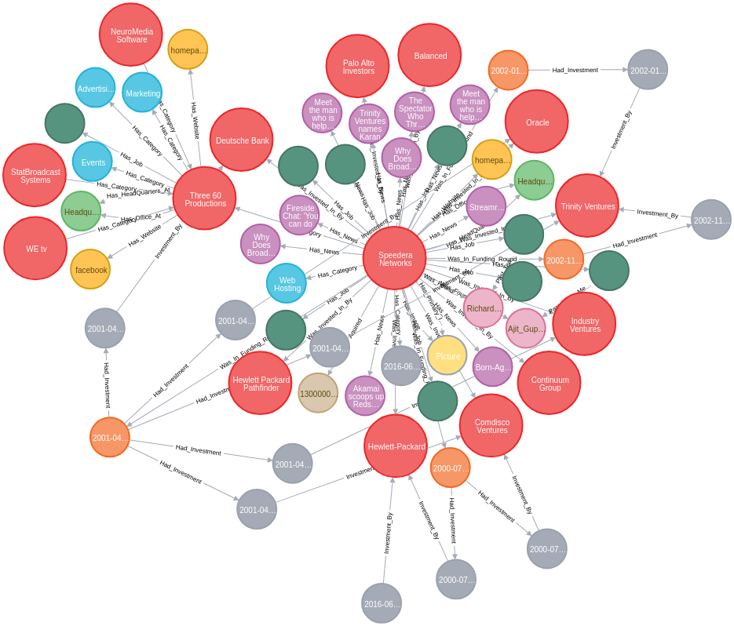
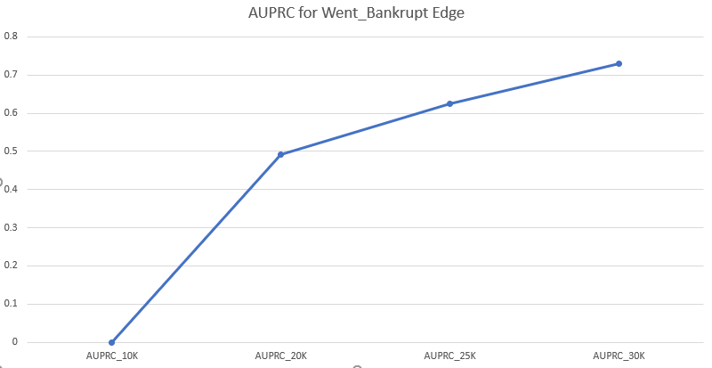
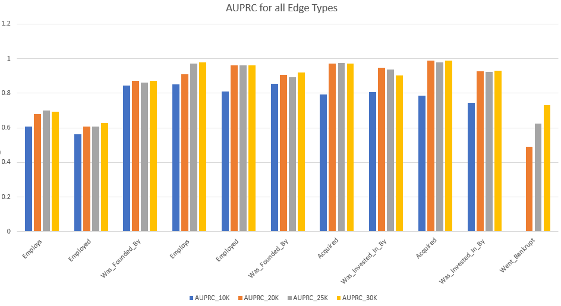

# Deep Link Prediction for Graphical Database

## 1. Motivation and Goal
In recent years, deep learning has achieved great success in the fields of vision, speech, and natural language understanding. The ability of deep learning to extract underlying patterns from complex, large-scale and high-dimensional data is well recognized. Many real-world applications are built on a graphical database, and thus utilize graphs for storing data. The graph here means a directed, attributed multi-graph with data stored as nodes and relationships (links) between nodes stored as edges. Graphical databases are ubiquitous and often consist of hundreds of millions of nodes and relationships. There is rich information embedded in the complex topology of these graphs that can be leveraged when doing inference on the data stored in them. As a result, utilizing deep learning to extract this information has gained a lot of traction in the research community. 

In order to address the aforementioned problem, we followed two distinct approaches. In the first approach, we propose a Graph-Based Classification Model using a Convolutional Neural Network (CNN) that uses nodal features as well as the structure of a node's local sub-graph to predict links between graph nodes by using an adjacency matrix formulation. In the second approach, we propose a Graph Convolutional Neural Network (GCNN) which has a structure similar to an autoencoder. This formulation enables us to use our prior information about the structure of the graph more efficiently by putting a relational inductive bias [1] into our model.

## 2. Related Work
Neural networks that operate on graphs, and structure their computations accordingly, have been
developed and explored extensively for more than a decade under the umbrella of “graph neural
networks” [2], but have grown rapidly in scope and popularity in recent years.

Models in the graph neural network family, e.g. [3], have been explored in a diverse range of problem
domains, across supervised, semi-supervised, unsupervised, and reinforcement learning settings.
These models have been effective at tasks thought to have rich relational structure, such as visual
scene understanding tasks [4] and few-shot learning [5]. They have also been extensively used to
reason about knowledge graphs [6,7]. For more applications of graph neural network models, see [1]
and references therein.

Recently, [8] introduced the message-passing neural network (MPNN), which unified various previous
graph neural network and graph convolutional network approaches by sequentially updating edge
attributes, node attributes and global attributes of the graph and transmitting the information after
each update. In a similar vein, [9] introduced the non-local neural network (NLNN), which unified
various “self-attention”-style methods by analogy to methods from computer vision and graphical
models for capturing long range dependencies in signals.

Graph neural network models usually consist of Graph Network (GN) blocks and can be divided into
three main categories depending on the task that needs to be served. Node-focused and graph-focused
GNs use the nodes attributes and the global attributes as outputs respectively. On the other hand, in
the spirit of [10,11], our main scope in this project is the design of an edge-focused neural network in
order to predict the existence of an edge between two nodes as well as its corresponding label.

## 3. Dataset 
We have used a combined dataset consisting of Bloomberg Bankruptcy Data for Companies (Year: 2009-2019) and a graph dataset containing approximately 6 million nodes (Person, Organizations, etc) with 10 million relationships.

    

Our graph dataset contains 8 types of nodes and 14 types of edges. Our goal was to initially create a super-node called Bankruptcy node and connect all US companies which filed bankruptcy according to the Bloomberg financial data. Then, by using the Image Segmentation model approach and the GCNN approach, we tried to predict the existence of an edge between a Company node and the Bankruptcy super-node.
It is worth mentioning the high class-imbalance problem we faced since the graph dataset contained >600,000 companies out of which only ~3,500 companies had filed bankruptcy according to the collected Bloomberg financial data. 

## 3. Dataset 

#### i. Image Segmenatation Model

#### ii. Graph Convolutional Neural Network Model

Our approach to building a model using Graph Convolutional Neural Network (GCNN) to solve the multi-relational link prediction task in a multimodal finance graph had to take care of an important observation relating to the nature of the dataset. There is a huge variation in the number node pairs that the data set contains corresponding to each edge type. Therefore, it becomes important that we develop an end-to-end approach such that the model shares the parameters from different edge types. 

In our approach, we build a non-linear, multi-layer neural network model designed to operate on a graph. The model has two main components:

**a. Encoder:** The objective is to produce an embedding for each node in the graph

**b. Decoder:** A model that uses these embeddings to perform tensor factorization and predicts the edges

We built an end-to-end model where the node embeddings are optimized jointly along with tensor factorization
We describe the both the encoder and decoder in detail

**GCNN Encoder**

The input to the encoder is the nodal feature vectors $h_i$, and the graph $G = (V, R)$ with nodes $v_i~ \epsilon ~V$ and labeled edges $(v_i, r, v_j)$ where $r~ \epsilon ~R$ is an edge type.  The output is a d-dimensional embedding $h_{i}^{k+1}$ for each node. 

For a given node, the model takes into account the feature vector of its first-order neighbors. Since each neighbor can be of different node type and can have different edge label, we have a different neural network architecture for each node. Each node type can have different lengths of embeddings; therefore, it is important that each edge type has a different set of weights. Note, an edge type is different if the node types are reversed. The convolution operators the we define in the encoder uses these weights depending on the neighbors and edge types. On successive application of these convolution operators, we essentially convolve across a K-hop distance in the graph for each neighbor. In other words, each node’s embeddings would have been formed using the information passed from all it’s Kth-order neighbors, while taking into account the different edge types *(Schlichtkrull et al., 2017)*. A single convolution on the neural network takes the following form 

### $h_{i}^{k+1} = \phi(\sum_r \sum_{j \epsilon N_r^i} c_r^{ij} W_r^k h_j^k + c_r^i h_i^k)$

Where $h_i^k$ the embedding of node $v_i$ in the kth layer with a dimensionality $d^k$, r is an edge type and $W_k^r$ is a weight/parameter matrix corresponding to it, $\phi$ represents a non-linear activation function, $c_r^{ij}$ are normalization constants. We build a two-layer model by stacking two layers of these. The input to the first layer is the node feature vectors or one-hot vectors if the features are not present.

##Results
**I. Image Segmentation Model (SegNet):**
We ran the Image segmentation model for the whole data-set and observed the following results:

**II. Graph Convolutional Network (GCN):**
We ran our GCN model for graphs with a different number of total nodes(10K, 20K, 25K, and 30K nodes) and observed the following results:

**NOTE:** AURPRC - Average Precision Score

   **Results of GCN Model for the Bankruptcy Edge (Went_Bankrupt)**
| Edge Type			| AUPRC_10K 	| AUPRC_20K 	| AUPRC_25K 	| AUPRC_30K 	|
|-----------------	|-----------	|-----------	|-----------	|-----------	|
| Went_Bankrupt   	| 0         	| 0.4906    	| 0.62563   	| 0.73012   	|

    

   **Results of GCN Model for all edge types (bi-directional) in the Graph**
| Edge Type          	| AUPRC_10K 	| AUPRC_20K 	| AUPRC_25K 	| AUPRC_30K 	|
|--------------------	|-----------	|-----------	|-----------	|-----------	|
| Employs            	| 0.6076    	| 0.6782    	| 0.70031   	| 0.69323   	|
| Employed           	| 0.56125   	| 0.6083    	| 0.60821   	| 0.62838   	|
| Was_Founded_By     	| 0.84427   	| 0.8729    	| 0.861     	| 0.87204   	|
| Employs            	| 0.85175   	| 0.9095    	| 0.97228   	| 0.97663   	|
| Employed           	| 0.81013   	| 0.9601    	| 0.96152   	| 0.96193   	|
| Was_Founded_By     	| 0.85535   	| 0.9046    	| 0.89107   	| 0.91841   	|
| Acquired           	| 0.79239   	| 0.9705    	| 0.97351   	| 0.9717    	|
| Was_Invested_In_By 	| 0.80587   	| 0.9489    	| 0.93843   	| 0.90202   	|
| Acquired           	| 0.78444   	| 0.9886    	| 0.97656   	| 0.99003   	|
| Was_Invested_In_By 	| 0.74629   	| 0.9259    	| 0.92427   	| 0.93148   	|
| Went_Bankrupt      	| 0         	| 0.4906    	| 0.62563   	| 0.73012   	|

    

We can observe that the average precision score for edge types increases as the number of nodes in the graph increases. Also, the GCN model for a partial sample (30K nodes) achieves a better average precision score compared to the SegNet model running on the complete dataset. We can observe that the GCN model avoids the issue of sparsity in adjacency matrices faced by the Image Segmentation model, by considering only connected neighbors. The GCN model also leverages the graphical structure of our data-set by incorporating nodal features for the nodes.

## References
1. P. W. Battaglia et al. Relational inductive biases, deep learning, and graph networks. arXiv preprint arXiv:
1806.01261, 2018.
2. M. Gori, G. Monfardini, and F. Scarcelli. A new model for learning in graph domains. In International
Joint Conference on Neural Networks, 2005.
3. Y. Li, D. Tarlow, M. Brockschmidt, and R. Zemel. Gated graph sequence neural networks. In International
Conference on Learning Representations (ICLR), 2016.
4. A. Santoro, D. Raposo, D. G. Barrett, M. Malinowski, R. Pascanu, P. Battaglia, and T. Lillicrap. A simple
neural network module for relational reasoning. In Advances in Neural Information Processing Systems, 2017.
5. V. Garcia and J. Bruna. Few-shot learning with graph neural networks. In International Conference on
Learning Representations (ICLR), 2018.
6. A. Bordes, N. Usunier, A. Garcia-Duran, J. Weston, and O. Yakhnenko. Translating embeddings for
modeling multi-relational data. In Advances in Neural Information Processing Systems, pages 2787–2795, 2013.
7. T. Hamaguchi, H. Oiwa, M. Shimbo, and Y. Matsumoto. Knowledge transfer for out-of-knowledge-base
entities: A graph neural network approach. In International Joint Conference on Artificial Intelligence
(IJCAI), 2017.
8. J. Gilmer, S. S. Schoenholz, P. F. Riley, O. Vinyals, and G. E. Dahl. Neural message passing for quantum
chemistry. arXiv preprint arXiv: 1704.01212, 2017.
9. X. Wang, R. Girshick, A. Gupta, and K. He. Non-local neural networks. In Proceedings of the Conference
on Computer Vision and Pattern Recognition (CVPR), 2017.
10. J. Hamrick, K. Allen, V. Bapst, T. Zhu, K. McKee, J. Tenenbaum, and P. Battaglia. Relational inductive
bias for physical construction in humans and machines. In Proceedings of the 40th Annual Conference of
the Cognitive Science Society, 2018.
11. T. Kipf, E. Fetaya, K.-C. Wang, M. Welling, and R. Zemel. Neural relational inference for interacting
systems. In Proceedings of the International Conference on Machine Learning (ICML), 2018.

__________________________________________________________________________________________________________________________________
How To Run:

___________________________________________________________________________________________________________________________________
Authors:

Aristotelis-Angelos Papadopoulos: aristotp@usc.edu

Collin Purcell					        : collinpu@usc.edu

Devershi Purohit				        : dupurohi@usc.edu

Ishank Mishra					          : imishra@usc.edu 
